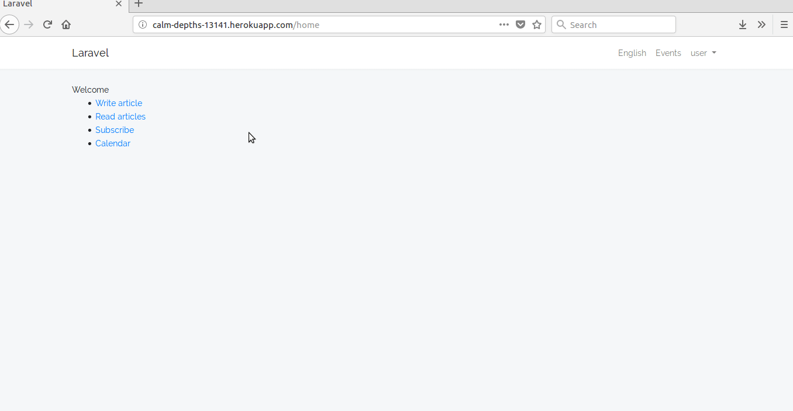
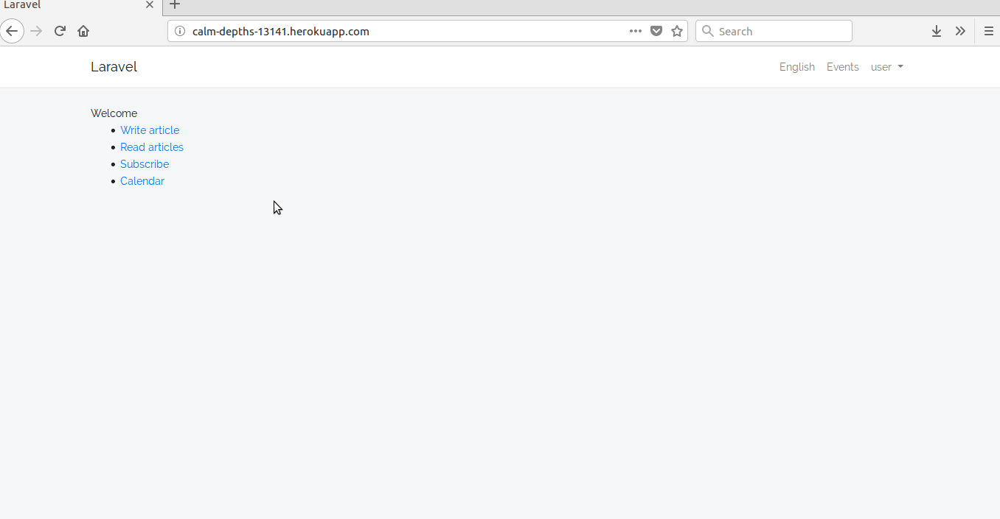
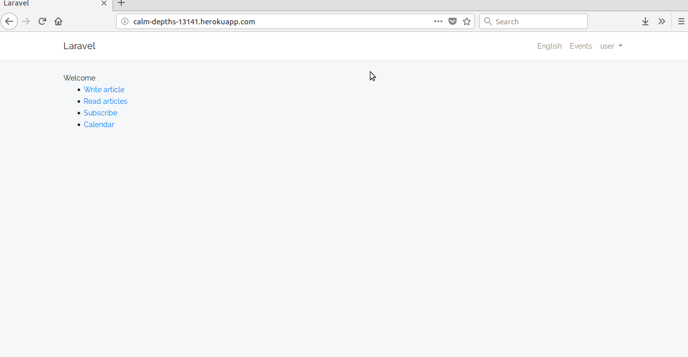
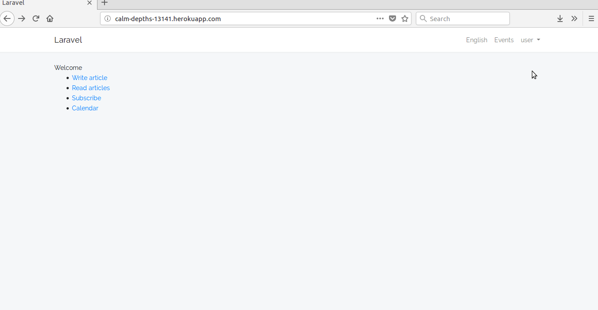

Live version: https://calm-depths-13141.herokuapp.com/

Planning on Trello: https://trello.com/b/97gCXVus/laravelgg

<h3><b>Project name: W8-Laravel</b></h3>

  
<h3><b>Description:</b></h3>

  
W8-Laravel is a blog project to get acquainted with Laravel functionality. The app will provide users the basic features of a blog i.e. writing and reading articles, commenting and reading articles, and other functionalities to enhance the user experience

  
<h3><b>Usage:</b></h3>

  
<b>Register</b>

  
In order to register simply click on "Register" in the header to go to the registration page. On the registration page enter your data

  

     
  

  
<b>Writing an article</b>

  
Click on "Write article". On the "write" page enter a title, choose a category and write your article. After you are finished writing click on "Post!" to post your article. Only registered users can post articles 

  

     
  

  
<b>Commenting</b>

  
To comment on an article click on "Read articles", on the next page choose and open an article. On the article's page scroll down to the comment section and submit a comment. If you wish to leave a comment anonymously check the "Anonymous" box

  

     
  

  
<b>Rating</b>

  
In order to rate an article post click on "Read articles". On the next page choose and open an article. On the article's page scroll down to the ratings section and submit your rating.

  

     
  

  
<b>Change the language</b>

  
In order to change the language simply click on the current language in the header and select your preferred language from the drop-down list.

  

     
  

  
<b>Calendar events</b>

  
Click on "Events" in the header to go to the calendar page. Enter the name, the start date and the end date of the event and click on "Add Event" to submit the event.

  

     
  

  
<b>Subscribing</b>

  
In order to subscribe for a payment plan simply click on "Subscribe" and choose a payment method. Enter a valid IBAN or creditcard and click on "Subscribe!".

  

     
  

